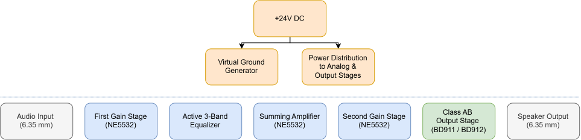

# Heart of Kraken

Heart of Kraken is a fully custom analog guitar combo amplifier designed and simulated from scratch.

The project was created to deepen my understanding of operational amplifiers, analog audio circuit design and PCB layout while developing a practical amplifier that can be used both with an electric guitar and as a compact audio power amplifier for a 6 Ω loudspeaker.

Unlike many hobby projects based on existing schematics, the entire architecture, calculations, simulations and PCB layout were developed independently.

## Table of Contents

- [Project Goals](#project-goals)
- [Features](#features)
- [Hardware Architecture](#hardware-architecture)
- [Circuit Description](#circuit-description)
  - [Power Supply](#power-supply)
  - [First Gain Stage](#first-gain-stage)
  - [Active 3-Band Equalizer & Summing Amplifier](#active-3-band-equalizer--summing-amplifier)
  - [Second Gain Stage](#second-gain-stage)
  - [Class AB Output Stage](#class-ab-output-stage)
- [PCB Design](#pcb-design)

## Project Goals

* Learn practical analog circuit design
* Gain hands-on experience with operational amplifiers
* Design an active three-band equalizer
* Develop a Class AB transistor power amplifier
* Design a manufacturable PCB in Altium Designer
* Verify the circuit using NI Multisim
* Produce approximately 5–6 W into a 6 Ω speaker

## Features

|Parameter|Value|
|-|--------|
| Supply Voltage  | 24 V DC                         |
| Input           | 6.35 mm Jack                    |
| Output          | Speaker terminal / 6.35 mm Jack |
| Load            | 6 Ω                             |
| Output Power    | ~5–6 W                          |
| Amplifier Type  | Analog                          |
| Output Stage    | Class AB                        |
| Op-Amp          | NE5532                          |
| Equalizer       | Active 3-band                   |
| PCB             | 2-layer                         |
| Design Software | Altium Designer                 |
| Simulation      | NI Multisim                     |
| Calculations    | MathCAD                         |

## Hardware Architecture

  

Figure 1. High-level functional block diagram of the amplifier.

The amplifier consists of a first gain stage built around an NE5532 operational amplifier, followed by an active three-band equalizer, a summing amplifier, a second gain stage and a complementary Class AB output stage based on BD911 and BD912 transistors. The entire circuit operates from a single 24 V DC supply with a virtual ground reference for the analog stages.

## Circuit Description

The amplifier consists of several functional blocks that process the audio signal from the input connector to the loudspeaker while operating from a single 24 V DC power supply.

### Power Supply

The amplifier operates from a single 24 V DC power supply.

  

Figure 2. Power Supply 

Since the analog circuitry is built around operational amplifiers while only a single supply voltage is available, a dedicated virtual ground generator creates a stable mid-supply reference used by all low-level analog stages. This approach allows the amplifier to process bipolar AC signals without requiring a dual power supply.

The power distribution network separately supplies the analog circuitry and the output stage while providing local decoupling capacitors near each active device.

### First Gain Stage

The first gain stage is built around one section of the NE5532 operational amplifier.

  

Figure 3. First Gain Stage 

Its primary function is to amplify the low-level signal from the guitar before further processing. The voltage gain is adjustable using a potentiometer placed in the negative feedback loop, allowing the amplifier to provide anything from a clean signal to moderate overdrive.

Placing the gain control before the equalizer allows the tone control stage to shape both clean and distorted signals.

### Active 3-Band Equalizer & Summing Amplifier

The tone control section is implemented as an active three-band equalizer based on first-order active filters providing independent adjustment of bass, midrange and treble frequencies.

  

Figure 4. Active 3-Band Equalizer & Summing Amplifier 

During the design process it became apparent that directly connecting the first-order filter outputs to the summing amplifier caused undesirable interaction due to their relatively high output impedance.

This issue was resolved by introducing voltage followers after each filter stage. The buffers provide high input impedance and low output impedance, effectively isolating the filter stages and preventing unwanted interaction before the summing amplifier.

The resistor values at the amplifier inputs were optimized through simulation to achieve balanced equalizer operation.

### Second Gain Stage

After passing through the equalizer, the signal level is reduced due to filter attenuation.

  

 

Figure 5. Second Gain Stage 

The second gain stage restores the required voltage swing before driving the output stage.

### Class AB Output Stage

The output stage is implemented as a complementary Class AB emitter follower using BD911 and BD912 bipolar transistors.

Its purpose is to provide the current required to drive a 6 Ohm loudspeaker while preserving the voltage waveform generated by the preceding stages. Class AB operation offers a good compromise between efficiency, output power and crossover distortion, making it suitable for compact analog audio amplifiers.

The amplifier is designed to deliver approximately 5-6 W of output power from a single 24 V supply.

  

Figure 6. Class AB Output Stage 

## PCB Design

The PCB was designed from scratch in Altium Designer based on the final circuit schematic.

The board layout was organized according to the functional blocks of the amplifier, with the signal path arranged from the input stage to the output stage. Particular attention was given to component placement, grounding and routing of the higher-current output stage.

  

Figure 7. PCB all layers

The PCB layout follows the signal flow from the input stage to the output stage. Low-level signal traces are kept as short as practical to reduce the possibility of unwanted noise pickup.

The PCB uses separate signal and power ground paths to reduce the influence of output-stage currents on the low-level analog circuitry. The two ground paths are connected at a single point near the negative terminal of the 2200 µF C1 filter capacitor in the power supply circuit.

The power supply and Class AB output stage are located in the upper part of the PCB. The signal processing and virtual ground sections are located in the lower part of the PCB.

The output provides two connectors for the loudspeaker: a screw terminal XS3 for connecting speaker wires with tinned ends, and a 6.35 mm jack XS2 for connecting an external guitar cabinet.

The project logo, "HEART OF KRAKEN", is placed in the center of the PCB.

  

Figure 8. 3D model of the PCB - top view 

  

Figure 9. 3D model of the PCB - bottom view 

Manufacturing files were generated from Altium Designer and the PCB was manufactured by JLCPCB.

  

Figure 10. Manufactured PCB 

